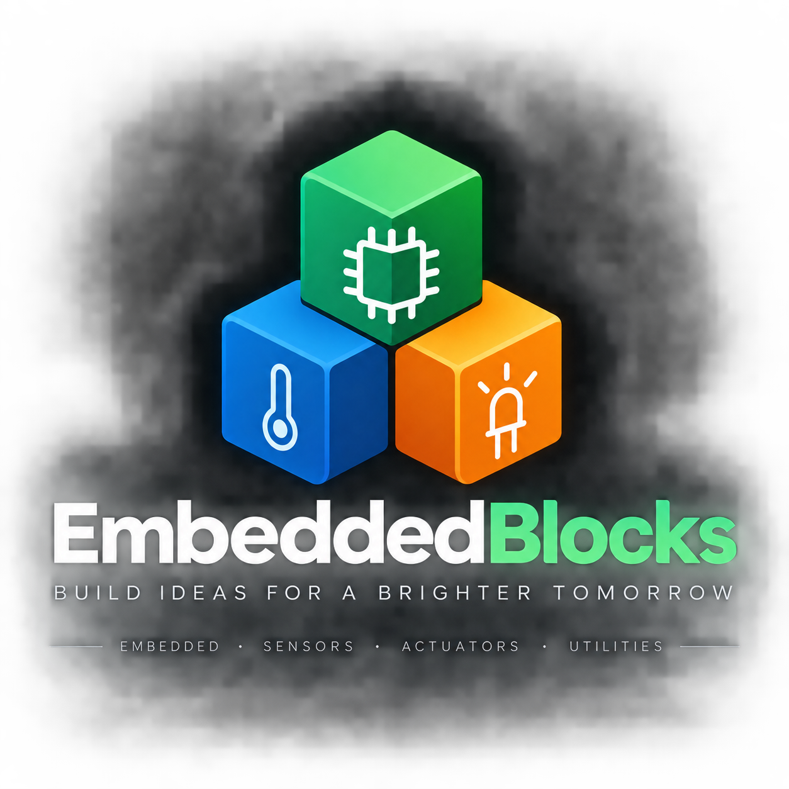

<p align="center">
  
</p>

# EmbeddedBlocks

**Build ideas for a brighter tomorrow.**

EmbeddedBlocks is a lightweight C++ library for embedded systems built around a simple idea: **small, expressive, reusable blocks that model hardware and behavior clearly**.

Instead of filling application code with raw `digitalWrite()`, `analogRead()`, PWM math, timing logic, and repeated conditions, EmbeddedBlocks provides abstractions that make the code describe **what the system means**, not only **how the hardware is driven**.

```cpp
Led statusLed(13);
Dallas roomSensor(4);
Threshold<float> hot(30.0f);

void setup()
{
    statusLed.begin();
    roomSensor.begin();
}

void loop()
{
    roomSensor.update();

    if (hot.test(roomSensor.temperature()))
        statusLed.on();
    else
        statusLed.off();
}
```

The goal is not to create a heavy framework. EmbeddedBlocks is intended to remain **small, composable, predictable, and suitable for constrained microcontrollers**.

---

## Philosophy

EmbeddedBlocks follows a few architectural principles:

- **Hardware abstractions should represent hardware**, not application logic.
- **Behavior should be composed**, rather than accumulated inside large classes.
- Prefer **HAS-A** when an object uses another object.
- Use inheritance only when there is a meaningful **IS-A** relationship.
- Keep hardware abstractions independent from higher-level systems such as orchestrators, protocols, or node controllers.
- Prefer fixed-size data, references, stack/static allocation, and compile-time abstractions where practical.
- Mathematical behavior should be reusable independently of hardware.
- Code should read like a description of the system.

A useful mental model is:

> Hardware defines the characters.  
> Effects define the actions.  
> Time defines the progression.  
> Composition tells the story.

---

## Core idea

A physical component should expose only the capabilities that naturally belong to it.

```cpp
Led led(13);

led.begin();
led.on();
led.off();
```

A PWM LED adds intensity:

```cpp
PwmLed led(9);

led.setBrightness(70);
```

An RGB LED adds color:

```cpp
RgbLed lamp(redPin, greenPin, bluePin);

lamp.setHue(220);
lamp.setBrightness(80);
```

But effects such as fade, breathing, strobe, hue cycling, or color interpolation are **not the LED itself**. They are behaviors applied to a device.

```text
RgbLed
  ▲
  │ acts on
  │
Fade      Breathing      Strobe      HueCycle
```

This separation allows each piece to remain reusable.

---

## Hardware and adapters

EmbeddedBlocks hardware classes are intended to work independently.

```cpp
Led statusLed(13);
```

If another project expects an interface such as `INode`, the hardware object can be wrapped by an adapter instead of becoming coupled to that framework.

```cpp
class LedNode : public INode
{
public:
    explicit LedNode(Led& led)
        : m_led(led)
    {
    }

private:
    Led& m_led;
};
```

Conceptually:

```text
NodeController
      │
      ▼
    INode
      ▲
      │
   LedNode        Adapter
      │
      ▼
     Led          Hardware abstraction
      │
      ▼
     GPIO
```

The `Led` remains reusable in projects that know nothing about `INode` or the NodeController.

---

## Sensors

Different physical sensors can expose a common semantic interface.

```cpp
class ITemperatureSensor
{
public:
    virtual ~ITemperatureSensor() = default;

    virtual void begin() = 0;
    virtual void update() = 0;
    virtual float temperature() const = 0;
};
```

Possible implementations:

```text
ITemperatureSensor
        ▲
   ┌────┼─────┬─────┐
   │    │     │     │
 LM35 Dallas DHT22  NTC
```

The application can then depend on the concept of *temperature*, not on the electrical details of each sensor.

---

## Mathematical building blocks

One of the main goals of EmbeddedBlocks is to treat mathematical behavior as reusable components.

### Threshold

```cpp
Threshold<float> hot(30.0f);

if (hot.test(sensor.temperature()))
{
    // react
}
```

### Range

```cpp
Range<float> comfortable(20.0f, 25.0f);

if (comfortable.contains(sensor.temperature()))
{
    // comfort zone
}
```

### Cubic response

A nonlinear response can create a soft comfort zone around a center point and increasingly stronger reaction farther away from it.

```text
input
  │
  ▼
center error
  │
  ▼
CubicResponse<T>
  │
  ▼
normalized reaction
```

### Easing and fade

Functions such as sine and cosine can define smooth time-based transitions.

```text
Time
 │
 ▼
SineFade
 │
 ▼
0.0 ─────────── 1.0
 │
 ▼
brightness / color / motor / animation / ...
```

The math does not need to know which device consumes the result.

---

## RGB lighting

RGB lighting is one of the first domains that will exercise the architecture.

The hardware layer may expose concepts such as:

```text
RgbLed
├── hue        0 .. 360
├── saturation 0 .. 100
└── brightness 0 .. 100
```

Effects remain independent:

```text
Effects
├── Fade
├── Blink
├── Strobe
├── Breathing
├── HueCycle
├── ColorTransition
└── RainbowCycle
```

A higher-level object such as `MoodLamp` may coordinate a device and an effect without implementing every effect itself.

```text
MoodLamp
   │
   ├── RgbLed
   │
   └── Effect
        ├── Fade
        ├── Breathing
        ├── Strobe
        └── HueCycle
```

---

## Planned repository structure

The initial structure will separate hardware, sensors, mathematical utilities, behaviors, and framework adapters.

```text
EmbeddedBlocks/
├── README.md
├── LICENSE
├── CMakeLists.txt
│
├── include/
│   └── EmbeddedBlocks/
│       │
│       ├── hardware/
│       │   ├── Led.h
│       │   ├── PwmLed.h
│       │   ├── RgbLed.h
│       │   ├── Button.h
│       │   └── Relay.h
│       │
│       ├── sensors/
│       │   ├── ITemperatureSensor.h
│       │   ├── LM35.h
│       │   ├── Dallas.h
│       │   ├── DHT11.h
│       │   ├── DHT22.h
│       │   └── NTC.h
│       │
│       ├── math/
│       │   ├── Threshold.h
│       │   ├── Range.h
│       │   ├── Hysteresis.h
│       │   ├── LinearResponse.h
│       │   ├── CubicResponse.h
│       │   ├── SineEase.h
│       │   └── MovingAverage.h
│       │
│       ├── effects/
│       │   ├── Fade.h
│       │   ├── Blink.h
│       │   ├── Strobe.h
│       │   ├── Breathing.h
│       │   ├── HueCycle.h
│       │   └── ColorTransition.h
│       │
│       ├── color/
│       │   ├── Color.h
│       │   ├── HsvColor.h
│       │   ├── RgbColor.h
│       │   └── ColorInterpolator.h
│       │
│       └── core/
│           ├── Time.h
│           └── Types.h
│
├── src/
│   ├── hardware/
│   ├── sensors/
│   ├── effects/
│   ├── color/
│   └── core/
│
├── adapters/
│   └── NodeController/
│       ├── LedNode.h
│       ├── RgbLedNode.h
│       └── TemperatureNode.h
│
├── examples/
│   ├── LedBasic/
│   ├── TemperatureThreshold/
│   ├── RgbHueCycle/
│   ├── MoodLamp/
│   └── NodeControllerAdapter/
│
├── tests/
│   ├── math/
│   ├── color/
│   └── effects/
│
└── assets/
    └── EmbeddedBlocks-logo.png
```

This structure is intentionally modular. Not every planned class needs to exist immediately. Components should be added only when a real use case justifies them.

---

## Architectural layers

The intended dependency direction is:

```text
Application / NodeController
            │
            ▼
         Adapters
            │
            ▼
 Effects / Math / Behavior
            │
            ▼
 Hardware abstractions
            │
            ▼
       MCU / GPIO / ADC
```

Lower layers should not depend on higher layers.

For example:

```text
Good
────
TemperatureNode ─────► ITemperatureSensor

Avoid
─────
DallasSensor ────────► NodeController
```

---

## Design goals

EmbeddedBlocks aims to provide:

- expressive APIs;
- low SRAM overhead;
- predictable behavior;
- reusable hardware abstractions;
- non-blocking timing whenever possible;
- minimal dynamic allocation;
- independent mathematical utilities;
- clean separation between hardware and behavior;
- compatibility with small embedded targets;
- code that is easy to read, test, and compose.

---

## Non-goals

EmbeddedBlocks is not intended to become:

- a full operating system;
- a large IoT framework;
- a protocol stack;
- a dependency-heavy abstraction layer;
- a replacement for specialized device libraries.

When a mature hardware library already exists, EmbeddedBlocks may wrap or adapt it instead of reimplementing its low-level protocol.

---

## Example vision

Eventually, application code should be able to read naturally:

```cpp
RgbLed lamp(RED_PIN, GREEN_PIN, BLUE_PIN);
Dallas roomSensor(TEMP_PIN);

Threshold<float> hot(30.0f);
Breathing breathing(2000);

void setup()
{
    lamp.begin();
    roomSensor.begin();
}

void loop()
{
    roomSensor.update();
    breathing.update();

    lamp.setBrightness(breathing.value() * 100.0f);

    if (hot.test(roomSensor.temperature()))
        lamp.setHue(0);
}
```

The code describes the system using the vocabulary of the problem.

That is the central idea behind EmbeddedBlocks.

---

## Status

🚧 **Early design / architecture phase**

The first implementations will focus on a small set of components and evolve incrementally from real embedded projects.

Initial candidates:

```text
Led
PwmLed
RgbLed
Threshold<T>
Range<T>
ITemperatureSensor
LM35 / Dallas
Fade
HueCycle
ColorTransition
```

---

## License

License to be defined.

